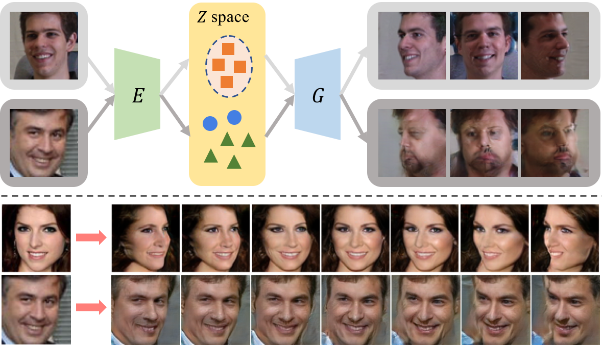
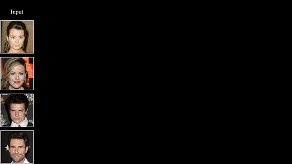

# CR-GAN: Learning Complete Representations for Multi-view Generation

Training code for the paper 
**[CR-GAN: Learning Complete Representations for Multi-view Generation](https://arxiv.org/abs/1806.11191.pdf)**, IJCAI 2018

## Overview
Prior works use "Encoder-Generator-Discriminator" framework to generate multi-view images for a single view input. Where training data is first mapped to a subspace via encoder, then the generator learns multi-view generation within this subspace. It lacks the ability to deal with new data, as an "unseen" data may be mapped out of the subspace, and the generator behavior for this case is undefined.

We propose a two-pathway framework to address this problem. Generation path is introduced to let generator generates in whole space. Reconstruction path is used to reconstruct all training data.

### Prerequisites

This package has the following requirements:

* `Python 2.7`
* `Pytorch 0.3.1`

## Dataset

Multi-PIE dataset webpage: http://www.cs.cmu.edu/afs/cs/project/PIE/MultiPie/Multi-Pie/Home.html

Our cropped version can be downloaded at: https://drive.google.com/open?id=1QxNCh6vfNSZkod1Rg_zHLI1FM8WyXix4

300w-LP dataset webpage: http://www.cbsr.ia.ac.cn/users/xiangyuzhu/projects/3DDFA/main.htm

Our cropped version can be downloaded at: https://drive.google.com/open?id=1DD6AO9Y5rAgiiW7IJY2kBxI_bCcfhYo4

Please cite the papers if using those dataset:

Multi-PIE: Ralph  Gross,   Iain  Matthews,   JeffreyCohn, Takeo Kanade, and Simon Baker. Multi-pie.ImageVision Computer, 28(5):807–813, 2010.

300w-LP: X. Zhu, Z. Lei, X. Liu, H. Shi, and S.Z. Li.Face Alignment Across Large Poses:  A 3D Solution.  In CVPR, 2016.

## Training

python train.py

## Results
Face rotation:

Face attribute manipulation:

